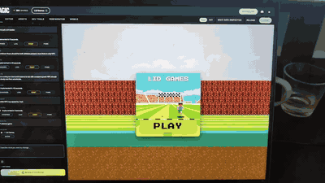

# lidder

[](https://github.com/mhjort/lidder/actions/workflows/ci.yml)

A small command-line tool that shows your MacBook's **lid angle** live in the terminal.

It reads Apple's lid angle HID sensor directly via IOKit — the same approach as
[samhenrigold/LidAngleSensor](https://github.com/samhenrigold/LidAngleSensor),
just as a CLI instead of a menu-bar app.



## Requirements

- macOS with a lid angle sensor (recent Apple Silicon MacBooks; tested on M4).
  M1/M2 models may not be supported.
- Swift toolchain (Xcode or Command Line Tools).

## Build

```sh
swift build -c release
```

The binary lands at `.build/release/lidder`. Optionally install it:

```sh
cp .build/release/lidder /usr/local/bin/
```

## Usage

### Terminal display

```sh
lidder              # live updating angle with a gauge bar
lidder --once       # print the angle once and exit
lidder --raw        # print just the number(s), one per line — good for scripts
lidder --hz 60      # set live refresh rate (default 30, max 120)
lidder --help       # full help
```

Live mode:

```
  126.0°  [█████████████████████░░░░░░░░░]  fully open
```

Press `Ctrl-C` to stop.

### HTTP server (for browser games)

```sh
lidder serve              # serve on http://127.0.0.1:8765
lidder serve --port 9000  # custom port
lidder serve --hz 60      # sensor sample rate
```

The server is bound to `127.0.0.1` only (loopback) — the sensor feed is never
exposed to the LAN, and macOS shows no firewall prompt. Open
`http://127.0.0.1:8765/` for a built-in demo game (a flyer controlled by the
lid angle), or build your own against the API below.

#### API

| Endpoint      | Description                                                        |
| ------------- | ----------------------------------------------------------------- |
| `GET /stream` | Server-Sent Events; one `data:` message per sample (~`--hz`/sec)  |
| `GET /angle`  | Latest sample as JSON                                             |
| `GET /health` | `{"ok":true}`                                                     |
| `GET /`       | Built-in demo game                                                |

Sample shape (degrees, degrees/sec, unix seconds):

```json
{ "angle": 126.0, "velocity": 4.2, "ts": 1780665838.404 }
```

`velocity` is a smoothed angular speed (always ≥ 0), useful for gesture controls
like a quick "flap" or "slam". All responses send `Access-Control-Allow-Origin: *`,
so a game served from another origin can connect too.

Consume the stream from a browser:

```js
const es = new EventSource('http://127.0.0.1:8765/stream');
es.onmessage = e => {
  const { angle, velocity } = JSON.parse(e.data);
  // drive your character
};
```

## How it works

The sensor is an Apple HID device (vendor `0x05AC`, product `0x8104`) on the
Sensor usage page (`0x20`, usage `0x8A`). `lidder` opens it and reads an 8-byte
feature report (report ID 1); bytes 1–2 are a little-endian `uint16` holding the
lid angle in degrees.

## Contributing

Issues and pull requests are welcome. Run the tests with `swift test`, and see
[CONTRIBUTING.md](CONTRIBUTING.md) for details.

## License

MIT — see [LICENSE](LICENSE).
